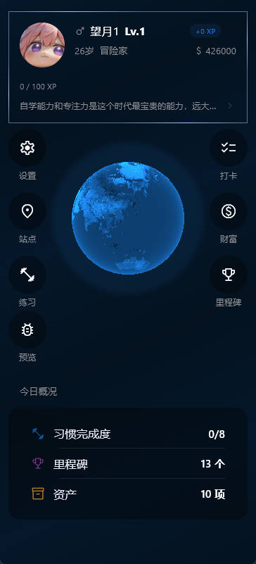
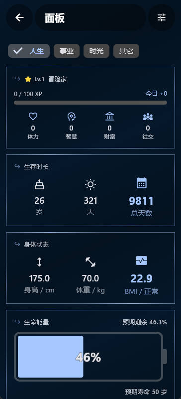
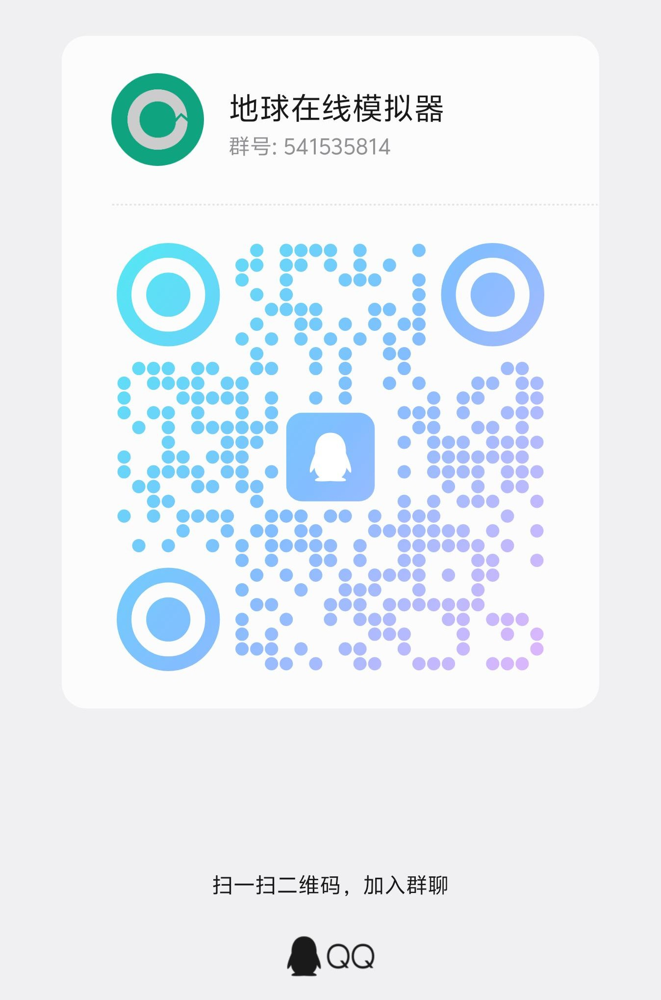

# Earth Online 发布仓库

【人生面板】/【地球在线】应用的官网、汇率数据与安装包发布仓库。

## 官网

https://lanrengm.github.io/earth-online-metadata/

## 安装包下载（Android）

https://gitee.com/lanren_007/earth_online/releases

## 汇率数据

欧洲央行（ECB）汇率，EUR 基准，由 GitHub Actions 每日 23:30 定时更新。

jsDelivr 加速链接：

```
https://cdn.jsdelivr.net/gh/lanrengm/earth-online-metadata@main/ledger/v1/exchange_rates.json
```

## 功能简介

### 人生面板

概览自己的一生。



### 任务面板

人生本来就没有意义，所谓的成功不过就是认准一个方向去做，无论成败此生都是无憾的。



## 加入内测Q群



## 仓库结构

```
├── .github/workflows/update_rates.yml   # 汇率定时更新工作流
├── ledger/v1/exchange_rates.json        # 汇率数据
├── update_ledger_rates.js               # 汇率抓取脚本
├── index.html / privacy.html / terms.html / style.css / app.js   # 官网
├── assets/                              # 应用截图与二维码
└── README.md
```
